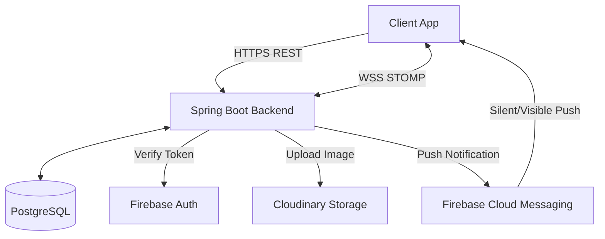
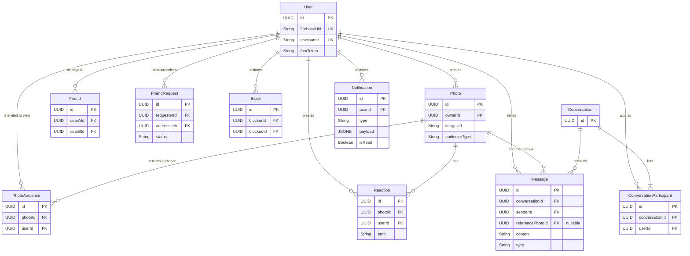
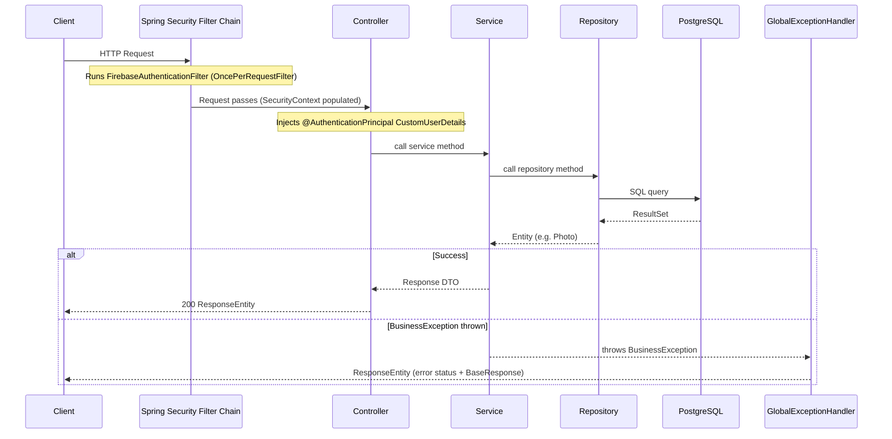
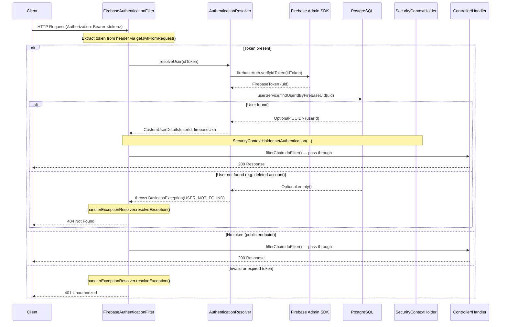
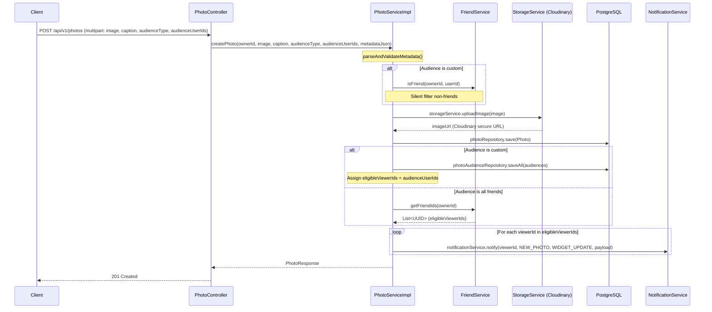
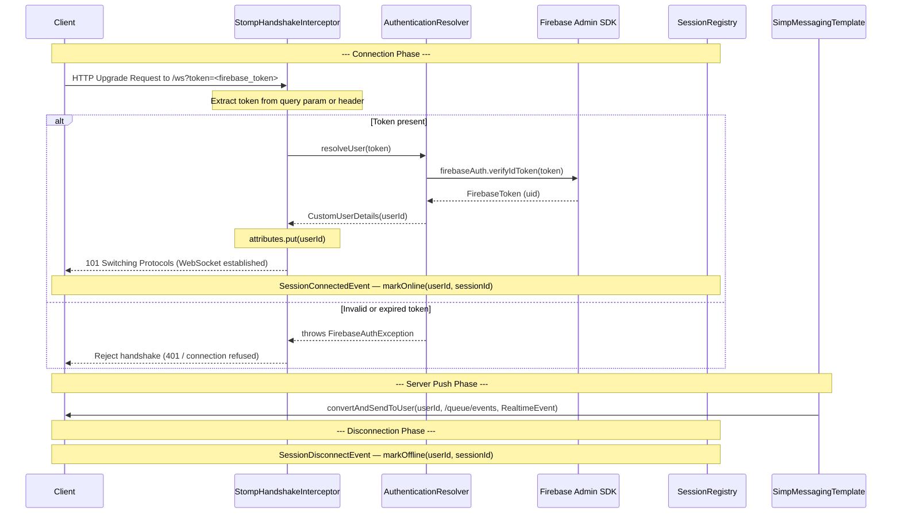
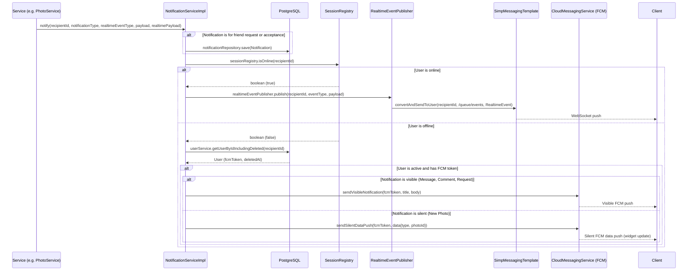

# Locket Clone Backend

Backend service for a social photo-sharing application inspired by Locket.

The system provides REST APIs for user management, friendships, photo sharing, feeds, reactions, comments, and 1-on-1 messaging. It also supports real-time events through WebSocket and push notifications through Firebase Cloud Messaging.

Built with Java, Spring Boot, PostgreSQL, Firebase, Cloudinary, and Docker.


---

## Table of Contents

- [Features](#features)
- [Tech Stack](#tech-stack)
- [Project Structure](#project-structure)
- [Getting Started](#getting-started)
- [Architecture & Design](#architecture--design)
- [Testing](#testing)
- [Known Limitations](#known-limitations)

---

## Features

- Authenticates users via Firebase (Phone OTP and Google Sign-In).
- Handles photo uploads and manages custom audience settings.
- Serves real-time photo feeds.
- Provides data to update home-screen widgets.
- Stores emoji reactions and comments on photos.
- Manages 1-on-1 private messaging.
- Handles friend requests (send, accept, decline, unfriend).
- Pushes notifications and in-app alerts for interactions.
- Deletes accounts and cascades deletion of photos and friendships, while anonymizing chat messages.

## Tech Stack

| Layer                     | Technology                                                            |
| ------------------------- | --------------------------------------------------------------------- |
| **Language**              | Java 17                                                               |
| **Framework**             | Spring Boot 4.1.1, Spring Data JPA, Spring Security, Spring WebSocket |
| **Database**              | PostgreSQL 16                                                         |
| **Authentication & Push** | Firebase Admin SDK 9.2.0                                              |
| **Storage**               | Cloudinary 1.38.0                                                     |
| **API Docs**              | springdoc-openapi (Swagger) 3.0.0                                     |
| **Build Tool**            | Maven                                                                 |
| **Containerization**      | Docker, Docker Compose                                                |
| **Testing**               | JUnit, Mockito, AssertJ                                               |

## Project Structure

```text
com.minh.locket_clone_backend
├── auth/         # Verifies Firebase tokens and handles authentication
├── chat/         # Manages 1-on-1 private conversations, messaging, and photo comments
├── common/       # Provides shared utilities, exceptions, and global configurations
├── feed/         # Aggregates and serves the photo feed
├── friend/       # Manages user relationships and friend requests
├── notification/ # Handles in-app notifications and FCM push delivery
├── photo/        # Handles photo uploads, metadata, and Cloudinary integration
├── reaction/     # Stores emoji reactions on photos
├── user/         # Manages user profiles and device tokens
└── websocket/    # Manages STOMP over WebSocket connections and real-time events
```

Modules follow package-by-domain architecture. Cross-module communication occurs exclusively through Service interfaces (e.g., `UserService`). Modules do not directly access other modules' Repositories.

## Getting Started

### Prerequisites

- Docker and Docker Compose (recommended)
- Java 17 (if running locally without Docker)
- Firebase Project with an Admin SDK `firebase-service-account.json` file
- Cloudinary Account

### 1. Clone the repository

```bash
git clone https://github.com/TrinhDacNhatMinh/locket-clone-backend.git
cd locket-clone-backend
```

### 2. Configure Environment

Create the `.env` file from the provided template:

```bash
cp .env.example .env
```

**Environment Variables**

| Variable                | Required | Description           |
| ----------------------- | -------- | --------------------- |
| `CLOUDINARY_CLOUD_NAME` | Yes      | Cloudinary cloud name |
| `CLOUDINARY_API_KEY`    | Yes      | Cloudinary API key    |
| `CLOUDINARY_API_SECRET` | Yes      | Cloudinary API secret |

Create a `config/` directory at the project root. Place the Firebase Admin SDK JSON file inside it:

```bash
mkdir config
# Place firebase-service-account.json into the config/ folder
```

### 3. Run the application

Run the application using Docker Compose (recommended) or locally via Maven.

**Option A: Run with Docker Compose (Recommended)**

Starts both the PostgreSQL database and the Spring Boot application container.

```bash
docker-compose -f docker-compose.yaml up --build -d
```

**Option B: Run with Maven (Local Development)**

Starts the database via Docker, then runs the Spring Boot app directly on the host machine.

```bash
# 1. Start the local Postgres database (uses compose.yaml)
docker-compose up -d

# 2. Run the Spring Boot app
mvn spring-boot:run
```

The API runs at `http://localhost:8080` in both scenarios.

## Architecture & Design

### System Architecture



### API Documentation

- **Swagger UI:** Available at `http://localhost:8080/swagger-ui/index.html`.
- **Authentication:** Most endpoints require a Firebase ID Token in the request header: `Authorization: Bearer <Firebase_ID_Token>`.

### Database Schema

Core domain entities:

- `User`: Stores user profiles and FCM tokens.
- `Photo` & `PhotoAudience`: Stores image URLs, metadata, and custom audience selection for non-public photos.
- `Friend` & `FriendRequest`: Manages relationships.
- `Block`: Manages blocked user relationships and privacy controls.
- `Conversation` & `Message`: Handles private chats and photo comments.
- `Reaction`: Handles emoji photo interactions.
- `Notification`: Stores in-app notification history.



### API Flow



### Authentication Flow



### Upload Image Flow



### WebSocket Flow



### Notification Flow



## Testing

Run tests via Maven:

```bash
mvn test
```

- **Scope:** Tests focus on the Service layer.
- **Dependencies:** Mocks external dependencies (Cloudinary, Firebase, Repositories) using Mockito for fast, isolated tests.
- **Naming Convention:** Methods follow the `methodName_condition_expectedResult` convention (e.g., `uploadPhoto_validFile_returnsPhotoResponse`).

## Known Limitations

- **Single FCM Token per User:** Stores one FCM token per user. Logging into a new device overwrites the previous token. Push notifications only reach the most recently active device. This simplifies token management.
- **No Group Features:** Supports 1-on-1 chats and individual friendships only. Group chats or shared albums are out of scope.
- **Account Deletion is Soft-Delete:** Nullifies the database link but does not call Firebase to delete the original identity. This avoids distributed transaction failures.
- **No Server-Side Photo Compression:** Assumes the client compresses photos before uploading. This saves server bandwidth and CPU usage.
